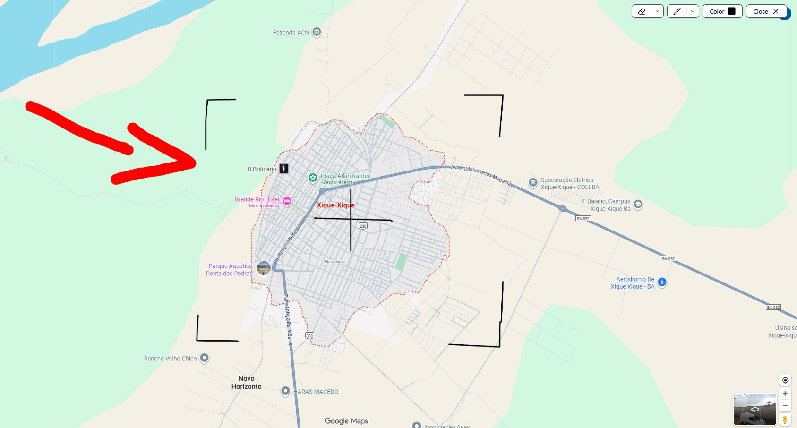

# 🖍️ Drawing Extension

--

This extension adds a floating toolbar to the browser, allowing you to draw, erase, and customize annotations directly on any website.

--

## ✨ Features

You can see buttons with certain functions in the upper right corner of the screen.

### Toggle Toolbar
- Show or hide the toolbar with a command (`toggleToolbar`).

### Drawing Tool (Brush)
- Free drawing on the screen.  
- Adjustable stroke thickness (up to 30px).  
- Supports multiple colors: **black, white, blue, red, green, yellow**.  

### Eraser
- Erase parts of the drawing by clicking on them.  
- Option to erase everything at once (**Remove All**).  

### Customization
- Visual indicator of the selected color.  
- Stroke width preview before drawing.  

### Close
- Removes all elements from the screen (toolbar + drawing canvas).  
- Resets states (color, width, eraser).  

---

## 🖌️ How It Works
- When activated, a transparent canvas is created covering the entire screen.  
- The canvas stays on top of the page and captures drawings.  
- The toolbar allows switching between tools (brush, eraser, colors, stroke width).  
- Drawings are smoothed using the **Ramer–Douglas–Peucker (RDP)** algorithm to simplify lines.  
- When closed, both the canvas and toolbar are removed, restoring the original page state.  

---

## ⚙️ Toolbar Structure

### Rubber Group (Eraser)
- `rubber-btn-1`: Toggle eraser.  
- `rubber-btn-2`: Open eraser menu.  
- `rubber-dropdown`: Options, including **Remove All**.  

### Draw Group (Brush)
- `draw-btn-1`: Toggle brush.  
- `draw-btn-2`: Adjust stroke thickness (LineWidth).  
- `linewidth-dropdown`: Input field to set stroke width.  

### Color
- `color-btn`: Open color selection menu.  
- `color-dropdown`: Selector with 6 predefined colors.  

### Close
- `close-btn`: Closes the toolbar and canvas.  

---

## 🚀 Example Usage
1. Activate the extension.  
2. Click the **pencil icon** to start drawing.  
3. Use the color menu to change stroke color.  
4. Adjust thickness with the **LineWidth** menu.  
5. Click the **eraser icon** to erase.  
6. Use **Remove All** to clear everything.  
7. Click **Close** to exit.  
